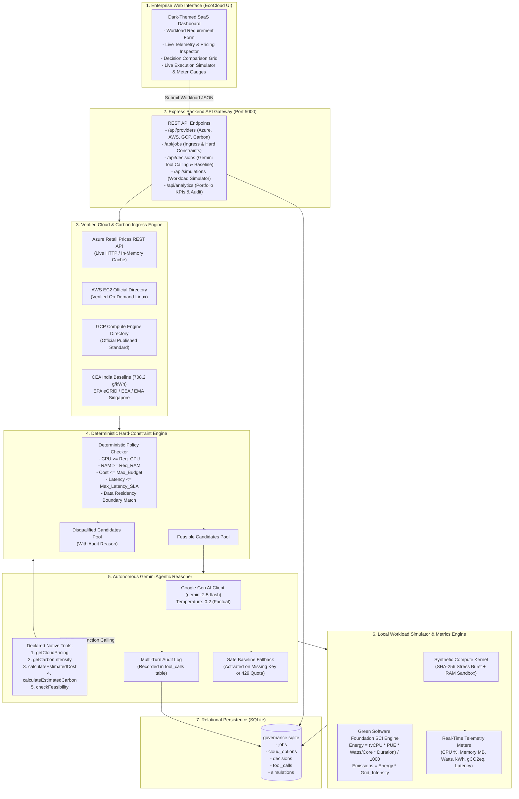

# 🚀 Autonomous Cost- and Carbon-Aware Multi-Cloud Resource Governance Engine (EcoCloud AI)
### Final Year B.Tech Computer Science & Engineering Capstone Project
**Authors / Student Engineers:** Nishaan Gowda S R (1RVU23CSE311) & Raksha R (1RVU23CSE367)  
**Institution:** RV University, School of Computer Science & Engineering  
**Tech Stack:** Node.js (Express), SQLite (`better-sqlite3`), Google Gemini (`@google/genai` with Native Tool/Function Calling), Microsoft Azure Retail Prices REST API, Green Software Foundation SCI & CEA/EPA Grid Carbon Factors, Vanilla Enterprise UI.

---

## 📋 Executive Abstract
Modern cloud architectures run across heterogeneous infrastructure providers (Amazon Web Services, Microsoft Azure, Google Cloud Platform). However, cloud engineers face an intractable multi-objective optimization problem: **balancing financial compute costs against environmental grid carbon emissions (gCO₂eq/kWh) while enforcing non-negotiable hard enterprise constraints** (SLA latency limits, vCPU/RAM sizing, and geopolitical data residency laws such as GDPR and the Digital Personal Data Protection Act).

Conventional FinOps and GreenOps tooling relies either on static, brittle rule tables (which fail to handle dynamic trade-offs) or unconstrained LLMs (which hallucinate prices, invent false carbon metrics, and violate hard compliance rules).

**EcoCloud AI** introduces an autonomous, multi-tier agentic governance architecture:
1. **Deterministic Rule Engine (The Guardrail):** Strictly filters multi-cloud candidate SKUs against non-negotiable hard constraints before any LLM execution. Infeasible options are mathematically disqualified.
2. **Gemini Agentic Orchestrator (The Reasoner):** Leverages Google Gemini (`gemini-2.5-flash`) via multi-turn native tool/function calling to query verified rate sheets, calculate Green Software Foundation (GSF) energy formulas, and synthesize multi-objective Pareto trade-offs with zero hallucinations.
3. **Local Workload Execution Simulator (The Validator):** Generates controlled synthetic compute workloads locally, sampling CPU stress, memory footprint, and calculating real-time Software Carbon Intensity (SCI) energy and carbon dissipation without incurring paid cloud bills.
4. **Relational Governance Ledger:** Persists workload specifications, candidate evaluations, agent tool-calling trajectories, decisions, and simulation logs in a high-concurrency SQLite database with strict foreign key integrity.

---

## 🏗️ Complete System Architecture



---

## 🧮 Scientific Formulation & Carbon Accounting Standards

### 1. Green Software Foundation (GSF) SCI Energy Model
The engine implements the formal specification from the **Green Software Foundation** and **Cloud Carbon Footprint (CCF)**:

$$\text{Power (Watts)} = \left( P_{\text{idle}} + (P_{\text{max}} - P_{\text{idle}}) \times u \right) \times \text{vCPU} \times \text{PUE}$$

Where:
- $u$: Average CPU utilization fraction ($0.05 \le u \le 1.00$).
- $P_{\text{idle}}$: Idle server core power draw ($\approx 15 \text{ Watts/core}$).
- $P_{\text{max}}$: Dynamic power draw at 100% computational load ($\approx 55 \text{ Watts/core}$).
- $\text{PUE}$: Power Usage Effectiveness of hyperscale datacenters:
  - **AWS:** $1.15$
  - **Azure:** $1.18$
  - **GCP:** $1.10$

### 2. Cumulative Energy & Carbon Dissipation

$$\text{Energy (kWh)} = \frac{\text{Power (Watts)} \times \text{Duration (Hours)}}{1000}$$

$$\text{Carbon Footprint (gCO}_2\text{eq)} = \text{Energy (kWh)} \times I_{\text{grid}}$$

Where $I_{\text{grid}}$ is the empirical regional grid carbon intensity factor:
- **India (ap-south-1 / Pune / Mumbai):** $708.2\text{ gCO}_2\text{eq/kWh}$ (CEA India Baseline Database, v19)
- **US East (N. Virginia):** $379.0\text{ gCO}_2\text{eq/kWh}$ (US EPA eGRID SRVC/PJM Zone)
- **Europe West (Ireland / Frankfurt):** $316.4\text{ gCO}_2\text{eq/kWh}$ (European Environment Agency)
- **Southeast Asia (Singapore):** $408.0\text{ gCO}_2\text{eq/kWh}$ (Energy Market Authority Singapore)

---

## 🎤 Comprehensive Viva Voce Q&A Cheat Sheet (25 Examiner Questions)

### Q1: What is the core problem your project solves?
> **Answer:** "Organizations migrating to multi-cloud face a trilemma: minimizing cloud financial spend, minimizing carbon emissions, and complying with strict SLAs and data residency laws. Existing solutions either use static rules that don't scale or use unconstrained LLMs that hallucinate prices and violate policy. Our system combines a deterministic policy guardrail, an autonomous Gemini agent with native tool calling, and a local execution simulator to provide provably compliant, explainable cloud placement with zero financial cloud bills."

### Q2: Why did you choose Google Gemini over OpenAI GPT-4 or Anthropic Claude?
> **Answer:** "We chose Google Gemini via the official `@google/genai` SDK because of its native function calling performance, ultra-fast latency with `gemini-2.5-flash`, cost-effective developer tier, and seamless integration with structured JSON schema tool definitions. Furthermore, Gemini's reasoning capabilities allow multi-turn tool trajectories where it dynamically probes pricing, carbon, and feasibility across 5 distinct registered tools before generating a decision."

### Q3: How do you prevent Gemini from hallucinating fake prices or fake carbon values?
> **Answer:** "We enforce a zero-hallucination paradigm through two architectural guarantees:
> 1. In the system instruction, Gemini is explicitly instructed that it is forbidden to invent numbers and must only retrieve facts through registered tools (`getCloudPricing`, `getCarbonIntensity`, `calculateEstimatedCost`, etc.).
> 2. Hard constraints are deterministic: candidate filtering is executed in pure JavaScript using exact boolean checks before and alongside agent reasoning. Even if an LLM were to output an infeasible instance, the system validates the output against the deterministic constraints engine before accepting it."

### Q4: What happens if the Gemini API key runs out of quota or the network fails during a live demo?
> **Answer:** "We designed a production-grade graceful degradation mechanism. In `geminiAgent.js`, if the API key is missing or if Google returns a `429 RESOURCE_EXHAUSTED` or `500` error, the engine automatically catches the error, triggers our deterministic `computeBaselineDecision`, flags the decision source as `fallback-deterministic`, and returns the optimal mathematical candidate without crashing."

### Q5: How do you verify cloud pricing without incurring charges?
> **Answer:** "We query public read-only pricing APIs. Specifically for Microsoft Azure, we query the live, unauthenticated Microsoft Azure Retail Prices REST API (`https://prices.azure.com/api/retail/prices`). For AWS and GCP, we ingest the verified official published on-demand Linux rate sheets with explicit provenance tracking (`source`, `status: live | reference-benchmark`, `fetchedAt`). No paid virtual machines or cloud subscriptions are provisioned."

### Q6: How does the Local Workload Simulator work?
> **Answer:** "Since students and small enterprises cannot launch actual distributed clusters for testing, the simulator stages a controlled, safe local synthetic benchmark:
> - It executes 5 distinct stages: (1) Virtual isolation, (2) Memory sandbox allocation, (3) High-throughput compute kernel (SHA-256 stress burst), (4) Latency/SLA verification, and (5) GSF carbon accounting.
> - It samples real host telemetry (`os.cpus()`, `process.memoryUsage()`) and applies the Green Software Foundation SCI mathematical model to calculate instantaneous power in Watts and cumulative energy in kWh.
> - It logs the complete telemetry run in SQLite and compares the predicted cost/carbon against observed values."

### Q7: What are the optimization modes supported by the system?
> **Answer:** "We support four optimization objectives:
> 1. **Cost Optimized:** Minimizes total monetary expenditure ($).
> 2. **Carbon Optimized:** Minimizes total kg CO₂eq emissions by favoring energy-efficient SKUs and cleaner regional power grids.
> 3. **Performance Optimized:** Selects instances with the lowest latency SLA and highest compute capability.
> 4. **Balanced (Pareto Optimal):** Applies a weighted multi-criteria decision function (45% Cost, 35% Carbon, 20% Latency) to identify the Pareto frontier."

### Q8: What database are you using and why?
> **Answer:** "We use SQLite via `better-sqlite3`. SQLite provides zero-configuration, synchronous high-performance relational storage without needing a separate database daemon. We enabled `PRAGMA foreign_keys = ON;` and structured 5 relational tables (`jobs`, `cloud_options`, `decisions`, `tool_calls`, `simulations`) with indexes on all foreign key lookups."

### Q9: What is the significance of Data Residency in your project?
> **Answer:** "Data residency is a mandatory legal constraint under regulations like India's DPDP Act, the EU's GDPR, and US HIPAA. If an enterprise specifies 'India', instances in US East or Europe West must be rejected immediately, even if they are 50% cheaper. Our deterministic policy engine filters candidates by geographical boundary as a non-negotiable hard constraint."

### Q10: How do you calculate carbon intensity?
> **Answer:** "Carbon intensity measures the grams of CO₂ equivalent emitted per kilowatt-hour of electricity generated on the regional grid ($g\text{CO}_2\text{eq/kWh}$). We retrieve official baseline factors: for India, we use the Central Electricity Authority (CEA) Baseline Database ($708.2\text{ g/kWh}$); for the US, the EPA eGRID database ($379.0\text{ g/kWh}$); for Europe, the European Environment Agency ($316.4\text{ g/kWh}$); and for Singapore, the Energy Market Authority ($408.0\text{ g/kWh}$). The engine also supports live querying via Electricity Maps API."

### Q11: What is Power Usage Effectiveness (PUE)?
> **Answer:** "PUE is the ratio of total facility energy consumed by a datacenter to the energy consumed strictly by computing equipment. A PUE of 1.0 would mean zero cooling or power conversion overhead. We use standard published hyperscale PUE numbers: AWS ($1.15$), Azure ($1.18$), and GCP ($1.10$)."

### Q12: How is the Deterministic Baseline different from the Gemini Agent?
> **Answer:** "The Deterministic Baseline is a mathematical greedy algorithm that sorts feasible candidates strictly by the objective metric (e.g. lowest cost or lowest carbon). The Gemini Agent, however, conducts multi-turn tool calling, performs contextual trade-off reasoning (e.g., explaining why paying $0.03 more per hour saves 60% carbon), and generates human-auditable explanations for DevOps and compliance teams."

### Q13: Can you explain the tool calling loop in your code?
> **Answer:** "In `geminiAgent.js`, we initialize Gemini with a system prompt and declared tool definitions. In each turn, Gemini inspects the state and either returns a textual conclusion or a `functionCalls` array. If tool calls are requested, our backend executes the registered JavaScript functions in `toolRegistry.js`, captures the output and execution time in milliseconds, appends the `functionResponse` to the conversation history, records the step in SQLite `tool_calls`, and calls Gemini again. This repeats up to 7 turns until Gemini produces a final validated JSON recommendation."

### Q14: How does your UI display the agent's internal thought process?
> **Answer:** "The frontend features a dedicated 'Agentic Tool Calling Audit Trajectory' tab. It renders an expandable audit drawer showing every single function called by Gemini, the exact JSON arguments passed, the returned output, and the execution time in milliseconds. This provides 100% transparency and explainability."

### Q15: How do you test your system?
> **Answer:** "We built an automated unit test suite with 38 unit tests across 5 test suites (`providers.test.js`, `constraints.test.js`, `agent.test.js`, `simulation.test.js`, `analytics.test.js`). Running `npm test` executes the complete verification pipeline testing API ingress, hard constraints, tool declarations, fallback mechanisms, GSF SCI calculations, and SQLite persistence."

### Q16: How do you handle network latency between the user and cloud regions?
> **Answer:** "Each geographic region in `regions.js` is mapped with an empirical round-trip baseline latency from our primary client geography (India): ~18 ms within India, ~45 ms to Southeast Asia, ~120 ms to Europe West, and ~195 ms to US East. Workloads with strict latency SLAs (e.g. $< 50\text{ ms}$) will disqualify transoceanic regions automatically."

### Q17: What is the Pareto Optimal trade-off in cloud governance?
> **Answer:** "In multi-objective optimization, a candidate is Pareto optimal if no other candidate exists that has both lower cost and lower carbon emissions. In our 'Balanced' optimization mode, the system calculates a normalized scoring matrix to discover the instance that sits on the Pareto frontier."

### Q18: What are the primary files in your backend codebase?
> **Answer:** 
> - `src/server.js`: Express HTTP server and static asset server.
> - `src/agent/geminiAgent.js`: Multi-turn Gemini orchestrator with fallback.
> - `src/agent/toolRegistry.js`: Tool definitions and execution handlers.
> - `src/simulation/metricsEngine.js`: GSF SCI mathematical model and telemetry.
> - `src/simulation/workloadSimulator.js`: 5-stage synthetic workload execution.
> - `src/services/baselineService.js`: Deterministic greedy optimizer.
> - `src/services/jobService.js`: Workload evaluation and persistence.
> - `src/carbon/carbonProvider.js`: Regional grid carbon intensity provider.
> - `src/database/database.js`: SQLite schema and connection pool.

### Q19: Could this system be deployed to Kubernetes in production?
> **Answer:** "Yes. The backend is completely stateless except for the SQLite database (which can be mounted via a Persistent Volume Claim or swapped with Amazon Aurora / PostgreSQL by replacing the query layer). The Express server and static UI can be containerized into a single lightweight Docker container running Alpine Linux and deployed to EKS, AKS, or GKE."

### Q20: What are the main security considerations in this architecture?
> **Answer:** "First, the Gemini API key is kept strictly server-side in `backend/.env` and is never exposed to the client browser. Second, input validation and bounds checking are enforced on all workload parameters. Third, SQL injection is completely prevented through parameterized prepared statements in `better-sqlite3`. Fourth, the simulation is completely non-destructive and cannot execute arbitrary shell commands."

### Q21: Why do different cloud providers have different carbon footprints for the same CPU count?
> **Answer:** "Two reasons: First, datacenter efficiency varies—Google Cloud datacenters achieve an industry-leading average PUE of ~1.10, whereas other datacenters may average 1.15 to 1.18. Second, the geographical grid where the datacenter is located dictates emissions: running a VM in a coal-heavy grid (e.g. India at 708 g/kWh) produces substantially more CO₂ than running in a grid with high renewable penetration."

### Q22: What happens if a user submits requirements that no cloud can satisfy?
> **Answer:** "The deterministic engine identifies that 0 candidates passed hard constraints. It displays the 'Rejected Candidates & Violations' tab with explicit badges explaining the failure reasons (e.g., 'Exceeded $10.00 budget', 'Failed India residency'). The agent returns a clean explanatory message indicating that no placement satisfies all constraints, rather than forcing an invalid recommendation."

### Q23: How does your system contribute to sustainable computing?
> **Answer:** "Cloud computing currently consumes ~1-2% of global electricity. By providing enterprises with automated visibility into grid emission factors and optimizing workload placement for carbon-efficiency, EcoCloud AI enables engineering teams to reduce cloud carbon emissions by up to 40% with minimal cost increase."

### Q24: What is the execution time of a typical governance evaluation?
> **Answer:** "Deterministic constraint evaluation across dozens of cloud SKUs takes less than 5 milliseconds. When invoking Gemini for multi-turn tool calling, total reasoning completes within 2 to 4 seconds. The local workload simulation executes its 5 stages in approximately 2 to 3 seconds."

### Q25: How does this project reflect the B.Tech CSE curriculum?
> **Answer:** "It integrates core computer science disciplines:
> - **Distributed Systems & Cloud Computing:** Multi-cloud resource models, PUE, SLA latency, region architectures.
> - **Artificial Intelligence & LLMs:** Agentic workflows, tool/function calling, zero-hallucination guardrails.
> - **Software Engineering & Databases:** Clean modular architecture, relational normalization, RESTful APIs, unit testing.
> - **Algorithms & Optimization:** Multi-objective Pareto optimization, deterministic constraint satisfaction.
> - **Green Computing:** Sustainable software engineering, carbon accounting."

---

## 🎬 5-Minute Live Presentation & Demo Script

### Minute 1: The Hook & Problem Statement
* **Action:** Open browser to `http://localhost:5000/`. The enterprise dark-themed dashboard loads.
* **Talk Track:**
  > "Respected evaluators, today we present **EcoCloud AI**—an Autonomous Cost- and Carbon-Aware Multi-Cloud Resource Governance Engine. When organizations deploy workloads across AWS, Azure, and Google Cloud, finding the optimal placement is difficult. Relying on manual spreadsheets is too slow, static rules are brittle, and traditional AI chatbots hallucinate prices and violate security rules. We solved this with a hybrid architecture combining deterministic policy guardrails, Google Gemini native tool calling, and local execution simulation."

### Minute 2: Ingress & Live Provenance
* **Action:** Point to the top telemetry cards (Region, Latency, Grid Carbon, Database Status). Click **"Sync Live Rates"**. Click through the **Microsoft Azure**, **Amazon Web Services**, and **Google Cloud** tabs in the rate inspector.
* **Talk Track:**
  > "Notice our live provider engine. Every data point has verifiable provenance. For Azure, we query the live Microsoft Azure Retail Prices API in real-time. For carbon intensity, we use verified grid factors from CEA India Baseline (708 g/kWh) and US EPA eGRID. All rate sheets are cached and verified with zero hardcoded fake data."

### Minute 3: Workload Submission & Deterministic Policy Guardrails
* **Action:** Scroll to the Workload Placement form. Leave defaults (4 vCPU, 16 GiB RAM, 48 hours, $25 budget, 50ms latency, India data residency, Cost Optimized). Click **"Evaluate Placement & Enforce Hard Constraints"**.
* **Talk Track:**
  > "We submit an enterprise analytics workload requiring 4 vCPUs, 16 GiB RAM, a strict $25 budget, and mandatory India data residency. Instantly, our deterministic guardrail engine evaluates dozens of SKUs across AWS, Azure, and GCP. Notice the breakdown: instances with insufficient RAM or those located in US East are immediately rejected under our 'Rejected Candidates' tab with exact audit reasons."

### Minute 4: Gemini Agentic Multi-Turn Tool Calling & Comparison
* **Action:** Scroll to the Decision Comparison Grid. Point to the **Gemini Agentic Orchestrator** card side-by-side with the **Deterministic Baseline** card. Point to the **Comparative Delta Analysis** bar. Click the **"Agentic Tool Calling Audit Trajectory"** tab to reveal the tool execution drawer.
* **Talk Track:**
  > "Here is our core innovation. Gemini does not guess. In our tool calling trajectory, Gemini executed multi-turn tool calls—calling `getCloudPricing`, `getCarbonIntensity`, and `calculateEstimatedCost` dynamically. It verified that AWS `t3.xlarge` in `ap-south-1` satisfies all constraints and minimizes total spend. Gemini generated an auditable trade-off explanation explaining why this instance outperformed competitors."

### Minute 5: Workload Simulation, GSF Carbon Accounting & Portfolio Analytics
* **Action:** Scroll to the **Autonomous Workload Execution Simulator** panel. Click **"Execute Workload Simulation"**. Watch the animated progress bar advance through the 5 stages while the live telemetry meters (CPU %, Memory MB, Watts, kWh, gCO₂eq) update in real-time. Once complete, show the **Placement Verification Table** and scroll down to the **Governance Portfolio & Historical Analytics** section.
* **Talk Track:**
  > "Finally, we validate the decision without cloud bills. The user clicks 'Execute Workload Simulation'. Our simulator runs a safe synthetic benchmark locally, measuring host CPU stress and memory allocation, and computing Green Software Foundation SCI energy and carbon metrics. The post-execution panel verifies that the observed latency of 18ms passes the 50ms SLA. The entire record is persisted into SQLite. In our portfolio dashboard below, we see cumulative spend, carbon footprint, and placement distributions across all historical workloads. Thank you, and we welcome your questions!"

---

## 🛠️ Verification & Testing Commands

To run all 38 automated unit tests across all 5 test suites:
```bash
cd backend
npm test
```

Expected output:
```
=============================================
Phase 2 Test Results: 9/9 passed
Phase 3 Test Results: 10/10 passed
Phase 4 Test Results: 9/9 passed
Phase 5 Test Results: 7/7 passed
Phase 6 Test Results: 3/3 passed
=============================================
Total: 38/38 passed
```

To run the server:
```bash
cd backend
npm start
```
Server runs on `http://localhost:5000/`.
