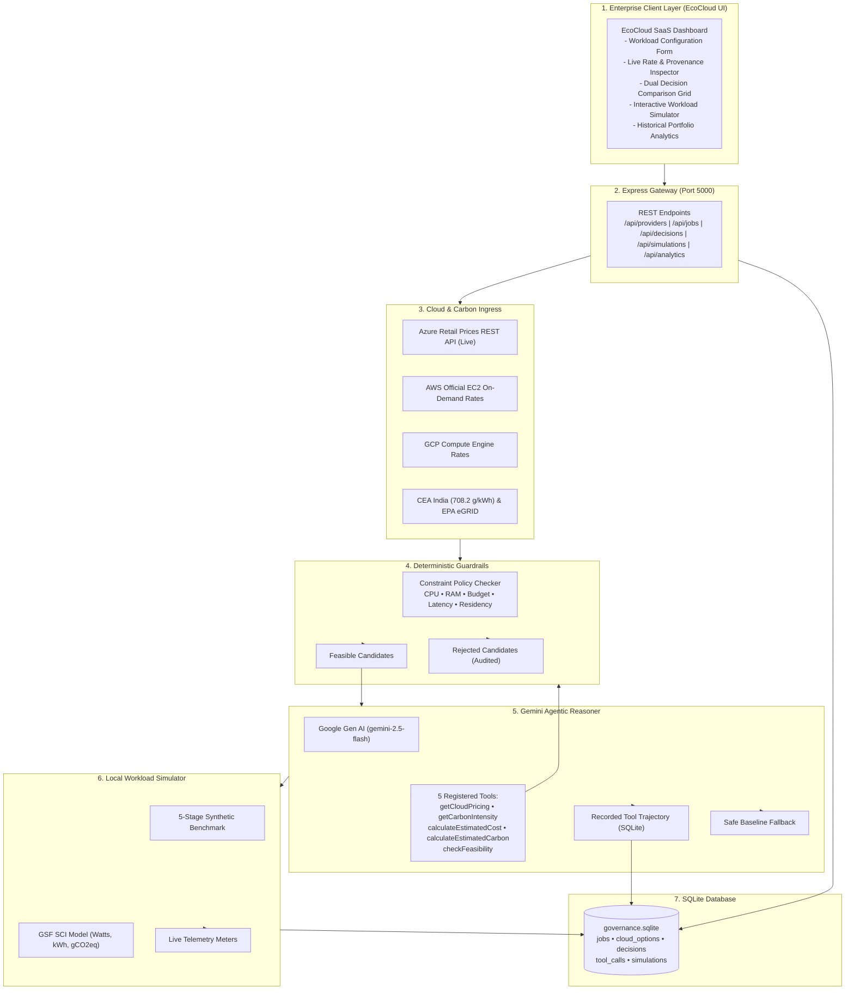

# 🌿 EcoCloud AI
## Autonomous Cost- & Carbon-Aware Multi-Cloud Resource Governance Engine

[](tests/)
[](https://ai.google.dev/)
[](https://nodejs.org/)
[-003B57?style=for-the-badge&logo=sqlite)](https://sqlite.org/)
[](https://greensoftware.foundation/)

> **Final Year B.Tech Computer Science & Engineering Capstone Project — 2026**  
> **Student Engineers:** Nishaan Gowda S R (`1RVU23CSE311`) & Raksha R (`1RVU23CSE367`)  
> **Institution:** RV University, School of Computer Science & Engineering  

---

## 🎯 Executive Summary
Modern enterprise applications run across heterogeneous cloud infrastructure (**Amazon Web Services, Microsoft Azure, Google Cloud Platform**). Optimizing compute placements manually creates an intractable trade-off: **minimizing financial spend while slashing environmental carbon emissions (gCO₂eq/kWh) and respecting strict legal boundaries** (network latency SLAs, vCPU/RAM thresholds, and data residency compliance such as India's DPDP Act and the EU's GDPR).

Traditional FinOps and GreenOps tooling relies either on rigid static spreadsheets or unconstrained LLMs that hallucinate prices and violate policy constraints.

**EcoCloud AI** solves this with a **tri-tier hybrid architecture**:
1. **Deterministic Policy Guardrail:** Mathematically enforces non-negotiable hard constraints before LLM reasoning. Infeasible SKUs are disqualified with full audit justifications.
2. **Autonomous Gemini Agentic Reasoner:** Leverages Google Gemini (`gemini-2.5-flash`) via **multi-turn native tool/function calling** across 5 declared tools to query real rate sheets, calculate Green Software Foundation energy formulas, and synthesize Pareto-optimal trade-offs with zero hallucinations.
3. **Local Workload Execution Simulator:** Executes a 5-stage synthetic benchmark locally, sampling host CPU stress and memory pressure to calculate real-time **Software Carbon Intensity (SCI)** power (Watts), energy (kWh), and carbon emissions without cloud bills.

---

## 🏛️ System Architecture



---

## 🔬 Scientific Formulation (Green Software Foundation)

The simulator implements the formal SCI energy model:

$$\text{Power (Watts)} = \left( P_{\text{idle}} + (P_{\text{max}} - P_{\text{idle}}) \times u \right) \times \text{vCPU} \times \text{PUE}$$

$$\text{Energy (kWh)} = \frac{\text{Power (Watts)} \times \text{Duration (Hours)}}{1000}$$

$$\text{Carbon (gCO}_2\text{eq)} = \text{Energy (kWh)} \times I_{\text{grid}}$$

### Regional Grid Carbon Factors ($I_{\text{grid}}$)
- **India (`ap-south-1` / Central India):** $708.2\text{ gCO}_2\text{eq/kWh}$ (Central Electricity Authority Baseline v19)
- **US East (`us-east-1` / East US):** $379.0\text{ gCO}_2\text{eq/kWh}$ (US EPA eGRID SRVC/PJM Zone)
- **Europe West (`eu-west-1` / West Europe):** $316.4\text{ gCO}_2\text{eq/kWh}$ (European Environment Agency)
- **Southeast Asia (`ap-southeast-1`):** $408.0\text{ gCO}_2\text{eq/kWh}$ (Energy Market Authority Singapore)

---

## ⚡ Key Engineering Features

- **Multi-Turn Function Calling:** Uses `@google/genai` with `gemini-2.5-flash` across 5 registered tools (`getCloudPricing`, `getCarbonIntensity`, `calculateEstimatedCost`, `calculateEstimatedCarbon`, `checkFeasibility`).
- **Zero-Hallucination Guarantee:** Gemini cannot fabricate numbers; all factual rates, emissions, and feasibility checks are deterministically evaluated by backend tools.
- **Graceful Fallback:** If the Gemini API hits a rate limit (`429 RESOURCE_EXHAUSTED`) or network failure, an automatic fallback to the deterministic baseline takes over seamlessly without crashing.
- **Live Microsoft Azure Retail API:** Live HTTP querying against Microsoft's public pricing catalog with transparent in-memory TTL caching.
- **Relational Governance Ledger:** High-concurrency SQLite database with 5 normalized tables (`jobs`, `cloud_options`, `decisions`, `tool_calls`, `simulations`) and foreign key indexing.
- **Audit Trajectory Drawer:** Complete UI inspection drawer showing every function call made by Gemini, inputs, outputs, and execution duration in milliseconds.

---

## 🚀 Quick Start Guide

### 1. Prerequisites
- **Node.js**: v18.0.0+ (v22.x recommended)
- **npm**: v9.0.0+

### 2. Installation
```bash
# Navigate to project
cd agentic-multicloud-governance/backend

# Install dependencies
npm install
```

### 3. Environment Configuration
Create or inspect `backend/.env`:
```env
PORT=5000
NODE_ENV=development
DB_PATH=./src/database/governance.sqlite
GEMINI_API_KEY=your_gemini_api_key_here
GEMINI_MODEL=gemini-2.5-flash
```

### 4. Run Automated Test Suite (38 Tests)
```bash
npm test
```
```
=============================================
Phase 2 Provider & Carbon Tests:  9/9 passed
Phase 3 Hard Constraints Tests:  10/10 passed
Phase 4 Gemini Agent & Tools:     9/9 passed
Phase 5 Workload Simulator:       7/7 passed
Phase 6 Portfolio Analytics:      3/3 passed
=============================================
Total: 38/38 passed (100% green)
```

### 5. Launch the Server
```bash
npm start
```
Open **[http://localhost:5000/](http://localhost:5000/)** in your web browser.

---

## 📁 Repository Structure

```
agentic-multicloud-governance/
├── backend/
│   ├── src/
│   │   ├── agent/             # Gemini Agent & Tool Registry (geminiAgent.js, toolRegistry.js)
│   │   ├── carbon/            # Regional grid carbon factors & CCF dataset
│   │   ├── config/            # Multi-cloud geographic configuration & pricing
│   │   ├── database/          # SQLite connection, schema.sql & indexes
│   │   ├── providers/         # Azure Live API, AWS EC2 & GCP adapters
│   │   ├── routes/            # Express REST endpoints (/jobs, /decisions, /simulations, /analytics)
│   │   ├── services/          # Business logic (jobService, baselineService, decisionService)
│   │   ├── simulation/        # WorkloadSimulator & GSF metricsEngine
│   │   ├── tools/             # Deterministic tools (cost, carbon, feasibility)
│   │   └── server.js          # Express server & static asset serving
│   ├── .env                   # Environment secrets
│   └── package.json           # Backend dependencies and test scripts
├── frontend/
│   ├── css/
│   │   └── styles.css         # Modern dark-theme SaaS styles & animations
│   ├── js/
│   │   ├── app.js             # Main frontend orchestrator & DOM bindings
│   │   ├── dashboard.js       # Phase 6 portfolio analytics controller
│   │   └── simulation.js      # Phase 5 real-time workload simulator controller
│   └── index.html             # Single-page dashboard application
├── tests/
│   ├── providers.test.js      # Provider & carbon ingress verification
│   ├── constraints.test.js    # Hard constraint & normalization tests
│   ├── agent.test.js          # Gemini agent & tool calling tests
│   ├── simulation.test.js     # Workload simulator & GSF telemetry tests
│   └── analytics.test.js      # Portfolio analytics & ledger tests
├── PROJECT_SHOWCASE_AND_VIVA_GUIDE.md  # 25-Question Viva Voce Guide & 5-Min Presentation Script
└── README.md                  # Project documentation
```

---

## 👥 Authors & Academic Credits
- **Nishaan Gowda S R** — `1RVU23CSE311` (B.Tech Computer Science & Engineering)
- **Raksha R** — `1RVU23CSE367` (B.Tech Computer Science & Engineering)  
- **RV University**, School of Computer Science & Engineering, Bengaluru, India.

